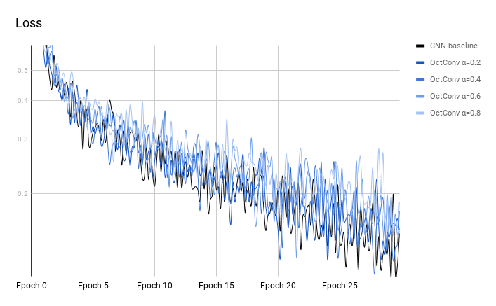
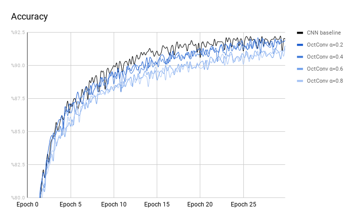

# Reproducing OctConv
Reproducing the [OctConv](https://arxiv.org/abs/1904.05049) and test on [FashionMNIST](https://github.com/zalandoresearch/fashion-mnist).

I have tested 3 different PyTorch implementations from (braincreators)[https://github.com/braincreators/octconv], [ThoroughImages](https://github.com/ThoroughImages/OctConv), and [iacolippo](https://github.com/iacolippo/octconv-pytorch). It seems that only the first one works as expected in terms of performance. I am trying to implement my own version in PyTorch based on the [codes](https://github.com/facebookresearch/OctConv) from the authors in MXNet.

Bellow are the benchmark results on FashionMNIST:

